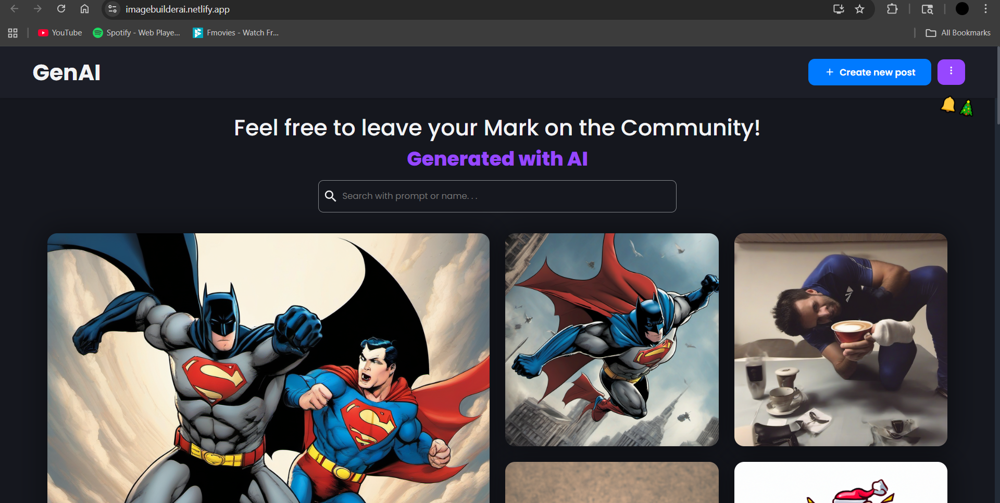
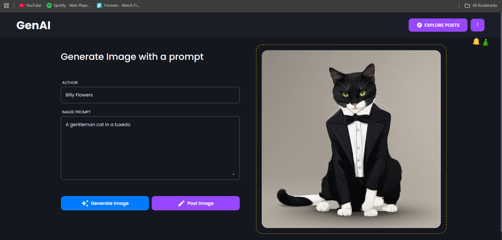

# Project Overview
This application takes a user prompt, sends it to the ~~OpenAI API (DALL·E 2)~~ **Hugging Face API (Stable Diffusion)**, and returns a unique AI-generated image.
 The image is then uploaded to Cloudinary, and metadata (prompt, author, image URL) is stored in MongoDB. A React frontend enables users to interact with the generator, browse past posts, and share their creations.

## 🔄 Recent Updates

**Migrated from OpenAI DALL·E 2 to Hugging Face Stable Diffusion**
- Better image quality and generation capabilities
- Lower cost
- Updated API integration for improved performance
- Enhanced model reliability


# Tech Stack
| Layer        | Tech Used                               |
| ------------ | --------------------------------------- |
| **Frontend** | React, Styled-Components                |
| **Backend**  | Node.js, Express.js                     |
| **Database** | MongoDB for metadata storage            |
| **Cloud**    | Cloudinary for image storage            |
| **AI**       | Hugging Face (Stable Diffusion)         |

## Homepage
 

## Create Post


Stable Diffusion provides high-quality image generation! 🎨  
~~The Dall-E 2 model is not that great, but it is cheap. 👍~~

# Getting Started
### Clone the Repository:
```
git clone https://github.com/Billy-Flowers/AI-Image-Builder.git
cd AI-Image-Builder
```

### Set Up Backend:
Navigate to the backend directory.
Install dependencies:
```
npm install
```

### Create a .env file and add your API key:
```
API_KEY=your_api_key_here
MONGODB_URI=mongodb_uri_from_mongodb_atlas_cluster
CLOUDINARY_CLOUD_NAME=your_key_here
CLOUDINARY_API_KEY=your_api_key_here
CLOUDINARY_API_SECRET=your_secret_key_here
```

### Set Up Frontend:
Navigate to the frontend directory.
```
npm start
```
Runs the app in the development mode. 
Open http://localhost:3000 to view it in your browser.

### Start the backend server:
```
node server.js
```
Interact with the frontend by entering text prompts and viewing generated images.


## Deployment
To deploy your application, consider using platforms like Netlify, Render or Vercel. I use Netlify for frontend and Render for backend. Ensure you configure environment variables, like your api keys and set up the necessary build processes as per the platform's documentation.

## Next Steps
- Enhance the Frontend: Add features like image downloading, prompt history, or user authentication.
- Optimize Performance: Implement caching mechanisms or use a CDN for faster image delivery.
- Expand Model Support: Integrate other AI models or offer users the choice of models for image generation.
